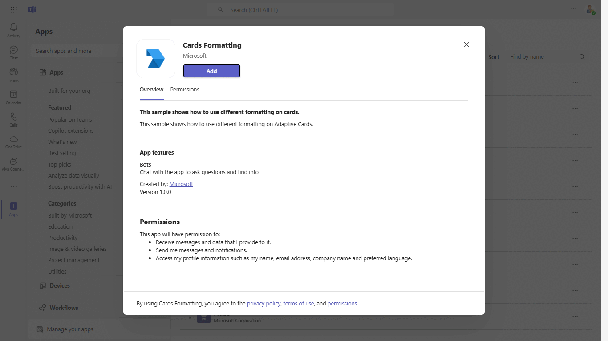
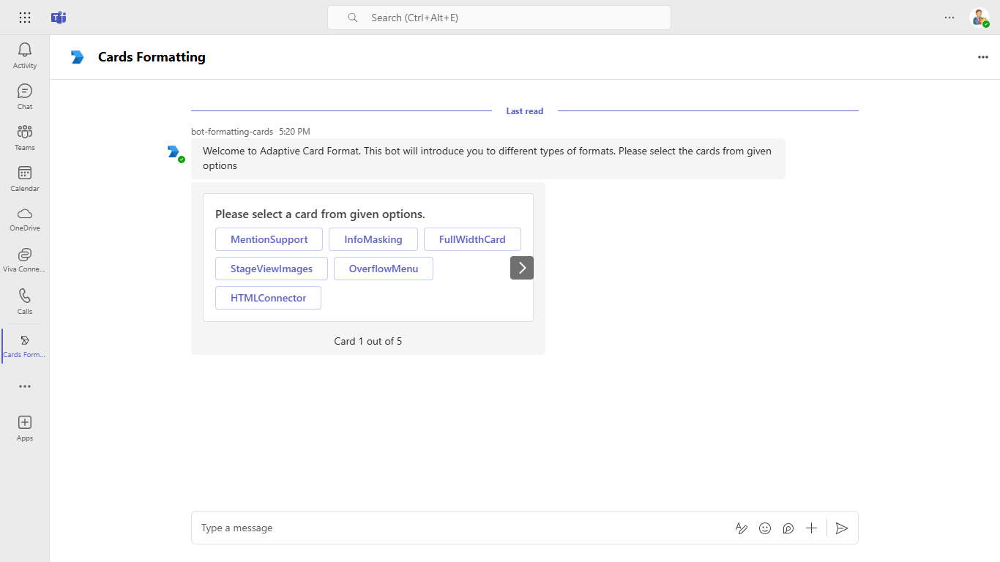
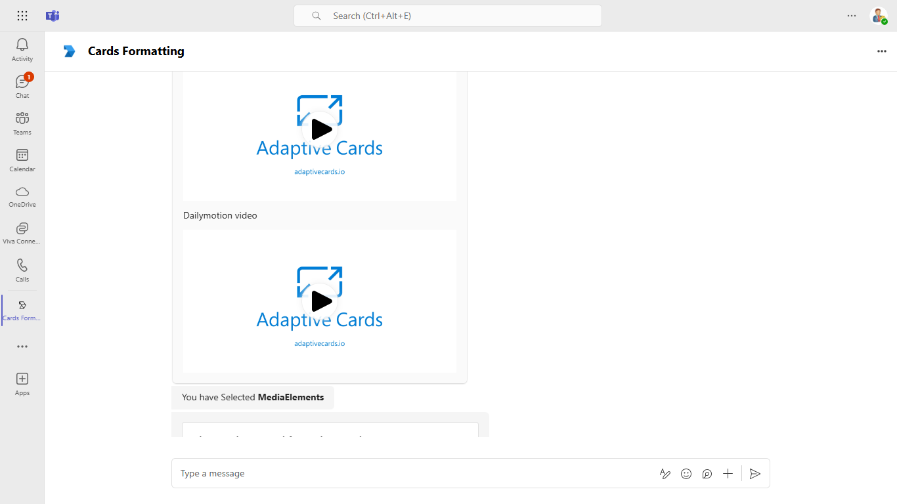
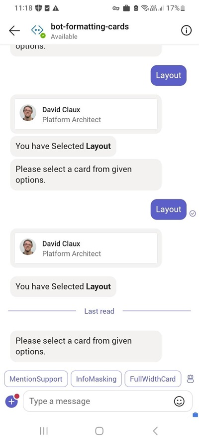
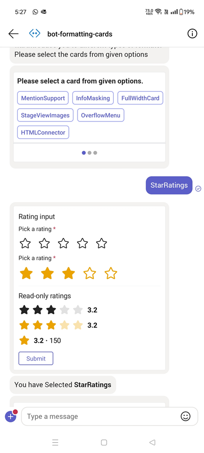
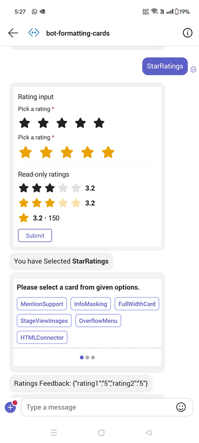

## Different Formatting Cards

Explore adaptive card formatting in Microsoft Teams with this bot sample. It includes features like mentions, emojis, persona icons, and different card layouts to enhance user interaction and presentation.

## Included Features
* Bots
* Adaptive Cards

## Interaction with app



## Try it yourself - experience the App in your Microsoft Teams client
Please find below demo manifest which is deployed on Microsoft Azure and you can try it yourself by uploading the app package (.zip file link below) to your teams and/or as a personal app. (Sideloading must be enabled for your tenant, [see steps here](https://docs.microsoft.com/microsoftteams/platform/concepts/build-and-test/prepare-your-o365-tenant#enable-custom-teams-apps-and-turn-on-custom-app-uploading)).

**Send different formatting on cards:** [Manifest](/samples/bot-formatting-cards/nodejs/demo-manifest/bot-formatting-cards.zip)

## Prerequisites

- Microsoft Teams is installed and you have an account (not a guest account).
- To test locally, [NodeJS](https://nodejs.org/en/download/) must be installed on your development machine (version 18x  or higher).
- [dev tunnel](https://learn.microsoft.com/en-us/azure/developer/dev-tunnels/get-started?tabs=windows) or [ngrok](https://ngrok.com/download) latest version or equivalent tunneling solution.
- [Teams Toolkit for VS Code](https://marketplace.visualstudio.com/items?itemName=TeamsDevApp.ms-teams-vscode-extension) or [TeamsFx CLI](https://learn.microsoft.com/microsoftteams/platform/toolkit/teamsfx-cli?pivots=version-one)

## Run the app (Using Teams Toolkit for Visual Studio Code)

The simplest way to run this sample in Teams is to use Teams Toolkit for Visual Studio Code.

1. Ensure you have downloaded and installed [Visual Studio Code](https://code.visualstudio.com/docs/setup/setup-overview)
1. Install the [Teams Toolkit extension](https://marketplace.visualstudio.com/items?itemName=TeamsDevApp.ms-teams-vscode-extension)
1. Select **File > Open Folder** in VS Code and choose this samples directory from the repo
1. Using the extension, sign in with your Microsoft 365 account where you have permissions to upload custom apps
1. Select **Debug > Start Debugging** or **F5** to run the app in a Teams web client.
1. In the browser that launches, select the **Add** button to install the app to Teams.

> If you do not have permission to upload custom apps (sideloading), Teams Toolkit will recommend creating and using a Microsoft 365 Developer Program account - a free program to get your own dev environment sandbox that includes Teams.

## Run the app (Manually Uploading to Teams)

> Note these instructions are for running the sample on your local machine, the tunnelling solution is required because the Teams service needs to call into the bot.

1. Register a new application in the [Microsoft Entra ID – App Registrations](https://go.microsoft.com/fwlink/?linkid=2083908) portal.

2. Setup for Bot
- In Azure portal, create a [Azure Bot resource](https://docs.microsoft.com/en-us/azure/bot-service/bot-builder-authentication?view=azure-bot-service-4.0&tabs=csharp%2Caadv2).
- Ensure that you've [enabled the Teams Channel](https://docs.microsoft.com/en-us/azure/bot-service/channel-connect-teams?view=azure-bot-service-4.0)
- While registering the bot, use `https://<your_tunnel_domain>/api/messages` as the messaging endpoint.

**NOTE:** When you create your bot you will create an App ID and App password - make sure you keep these for later.

3. Run ngrok - point to port 3978

   ```bash
   ngrok http 3978 --host-header="localhost:3978"
   ```  

   Alternatively, you can also use the `dev tunnels`. Please follow [Create and host a dev tunnel](https://learn.microsoft.com/en-us/azure/developer/dev-tunnels/get-started?tabs=windows) and host the tunnel with anonymous user access command as shown below:

   ```bash
   devtunnel host -p 3978 --allow-anonymous
   ```

4. Setup for code  
  - Clone the repository

    ```bash
    git clone https://github.com/OfficeDev/Microsoft-Teams-Samples.git
    ```

  - In a terminal, navigate to `samples/bot-formatting-cards/nodejs`
  - Update the `.env` configuration file and replace with placeholder `{{Microsoft-App-Id}}` and `{{Microsoft-App-Password}}`. (Note the MicrosoftAppId is the AppId created in step 1 (Setup Microsoft Entra ID app registration in your Azure portal), the MicrosoftAppPassword is referred to as the "client secret" in step 1 (Setup for Bot) and you can always create a new client secret anytime.)

**Update mentionSupport json**
- Bots support user mention with the Azure AD Object ID and UPN, in addition to the existing IDs. The support for two new IDs is available in bots for text messages, Adaptive Cards body, and message extension response. Bots support the mention IDs in conversation and invoke scenarios. The user gets activity feed notification when being @mentioned with the IDs.

  - Navigate to samples\bot-formatting-cards\nodejs\resources\mentionSupport.json
      1) On line 14, replace {{new-Ids}}  
      2) On line 23, replace {{Email-Id}}
      3) On line 31, replace {{Microsoft-App-Id}}
         
        - E.g. 
        ```
        "text": "Hi <at>Adele UPN</at>, <at>Adele Azure AD</at>"
            }
        ],
        "msteams": {
            "entities": [
            {
                "type": "mention",
                "text": "<at>Adele UPN</at>",
                "mentioned": {
                "id": "AdeleV@contoso.onmicrosoft.com",
                "name": "Adele Vance"
                }
            },
            {
                "type": "mention",
                "text": "<at>Adele Azure AD</at>",
                "mentioned": {
                "id": "87d349ed-44d7-43e1-9a83-5f2406dee5bd",
                "name": "Adele Vance"
                }
            }
            ]
        ```

  **Note: In adaptive card, what we are defining (User details) should be exist in the same tenant where you are testing the app (teams' login) etc...**
  - Update the user Microsoft Entra object ID in your adaptive card JSON from your tenant's Microsoft Entra ID users available in the Azure portal.
    - Navigate to samples\bot-formatting-cards\nodejs\resources\adaptivePeoplePersonaCardIcon.json
      1) On line 16, replace {{User-Object-ID}}  
      2) On line 17, replace {{User-Display-Name}}
      3) On line 18, replace {{User-Principal-Name}}

        - E.g. 
        ```
        "properties": {
        "id": "87d349ed-xxxx-434a-9e14-xxxx",
        "displayName": "Joe Smith",
        "userPrincipalName": "JoeSmith@xxxx.com"
      }
        ```
    - Navigate to samples\bot-formatting-cards\nodejs\resources\adaptivePeoplePersonaCardSetIcon.json
      1) On line 18, replace {{User-Object-ID}}  
      2) On line 19, replace {{User-Display-Name}}
      3) On line 20, replace {{User-Principal-Name}}
      4) On line 23, replace {{User-Object-ID}}  
      5) On line 24, replace {{User-Display-Name}}
      6) On line 25, replace {{User-Principal-Name}}
      
        - E.g. 
        ```
      "properties": {
        "users": [
          {
            "id": "95d349ed-xxxx-434a-9e14-xxxx",
            "displayName": "Vance Agrawal",
            "userPrincipalName": "VanceAgrawal@xxxx.com"
          },
          {
            "id": "45d349ed-xxxx-434a-9e14-xxxx",
            "displayName": "ku Mao",
            "userPrincipalName": "kuMao@xxxx.com"
          }
        ]
      }
        ```

> In `index.js` file at line number 40, uncomment commented line for local debugging.

  - Install modules

    ```bash
    npm install
    ```

  - Run your app

    ```bash
    npm start
    ```

5. Setup Manifest for Teams
- __*This step is specific to Teams.*__
    - **Edit** the `manifest.json` contained in the ./appManifest folder to replace your MicrosoftAppId (that was created when you registered your app registration earlier) *everywhere* you see the place holder string `{{Microsoft-App-Id}}` (depending on the scenario the Microsoft App Id may occur multiple times in the `manifest.json`)
    - **Edit** the `manifest.json` for `validDomains` and replace `{{domain-name}}` with base Url of your domain. E.g. if you are using ngrok it would be `https://1234.ngrok-free.app` then your domain-name will be `1234.ngrok-free.app` and if you are using dev tunnels then your domain will be like: `12345.devtunnels.ms`.
    - **Zip** up the contents of the `appManifest` folder to create a `manifest.zip` (Make sure that zip file does not contains any subfolder otherwise you will get error while uploading your .zip package)

- Upload the manifest.zip to Teams (in the Apps view click "Upload a custom app")
   - Go to Microsoft Teams. From the lower left corner, select Apps
   - From the lower left corner, choose Upload a custom App
   - Go to your project directory, the ./appManifest folder, select the zip folder, and choose Open.
   - Select Add in the pop-up dialog box. Your app is uploaded to Teams.


## Running the sample

**Install App:**


**Welcome Message:**



**Mention Card:**


**Information Mask Card:**


**FullWidth Adaptive Card:**


**Stage View Card:**


**Overflow Menu Card:**


**HTML Connector Card:**


**AdaptiveCard With Emoji:**


**Persona Card Icon:**


**Persona Set Icon:**


**Code Block in Adaptive Card:**


**Adaptive Card updated to be responsive using targetWidth:**


**Border Adaptive Card**


**Rounded Corners Adaptive Card**


**Select Fluent Icon:**


**Fluent icon in an Adaptive Card:**


**Select Media elements:**


**Media elements in Adaptive Card:**


**All Media elements in Adaptive Card:**



**Play video media elements in an Adaptive Card:**


**Select Star Ratings:**


**Star ratings in Adaptive Cards:**


**Star ratings in Adaptive Cards validation:**


**Star Ratings Feedback:**


**Mobile:**



**Star Ratings in Adaptive Cards:**



**Star Ratings Feedback:**



## Deploy the bot to Azure

To learn more about deploying a bot to Azure, see [Deploy your bot to Azure](https://aka.ms/azuredeployment) for a complete list of deployment instructions.

## Further reading
- [Format cards in Microsoft Teams](https://learn.microsoft.com/en-us/microsoftteams/platform/task-modules-and-cards/cards/cards-format?tabs=adaptive-md%2Cdesktop%2Cconnector-html)
- [Format cards with HTML](https://learn.microsoft.com/en-us/microsoftteams/platform/task-modules-and-cards/cards/cards-format?tabs=adaptive-md%2Cdesktop%2Cconnector-html#format-cards-with-html)
- [People icon in an Adaptive Card](https://learn.microsoft.com/en-us/microsoftteams/platform/task-modules-and-cards/cards/cards-format?tabs=adaptive-md%2Cdesktop%2Cconnector-html#people-icon-in-an-adaptive-card)
- [Fluent icon in an Adaptive Card](https://learn.microsoft.com/en-us/microsoftteams/platform/task-modules-and-cards/cards/cards-format?branch=pr-en-us-11655&tabs=adaptive-md%2Cdesktop%2Cconnector-html)
- [Media elements in Adaptive Card](https://learn.microsoft.com/en-us/microsoftteams/platform/task-modules-and-cards/cards/media-elements-in-adaptive-cards?branch=pr-en-us-11492&tabs=desktop%2Cdeveloper-portal-for-teams)


